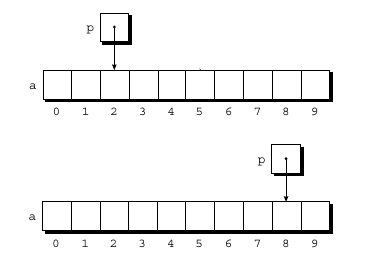
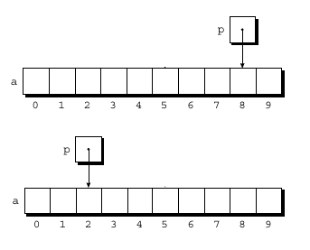

# Compiling & Linking
Source code is first given to the `preprocessor` then to the `compiler` then to the `assembler` and in the end it is passed to the `linker`. 
- **Preprocessor** processes the source file before compilation. It handles preprocessor directives such as `#include`, `#define`, and `#if`. When it encounters a header file via `#include`, it textually substitutes the contents of that header file into the source file.
- After preprocessing, the edited source file is passed to the **compiler**, which translates the high-level, human-readable code into **assembly language**. The generated assembly code is then passed to the **assembler**, which converts it into **machine language (binary)** and produces an **object file**.
- After compilation, the generated object files are passed to the **linker**. A program may be split across multiple source files and may also use functions and variables declared in header files but defined elsewhere. The compiler compiles each source file independently into an object file(.o). The linker then combines multiple object files into a single executable and links required libraries. The final output of the linker is a single executable that can be loaded and run by the operating system.

# Defining a name for Constants
When a program contains constants, it's often a good idea to give them names.

```c
//example 1
#define INCHES_PER_POUND 166

//example 2
#define PI 3.14
```
# Conversion Specification
A conversion specification can have a form : `%m.pX` or `%-m.pX`. Where `m` and `p` are integer constants and `X` is a letter. 
- **m :** specifies the minimum field width, i.e, the minimum number of characters to print. If the value to be printed requires fewer than *m* characters, extra spaces precede the value. For example, the specification %4d would display the number 123 as •123 ( used • to represent the space character).  If the value to be printed requires more than *m* characters, the field width automatically expands to the necessary size. %4d would display the number 12345 as 12345—no digits are lost. Putting a minus sign in front of m causes left justification; the specification %-4d would display 123 as 123•
- **p :** stands for precision and it depends on the choice of `X`. For `X`,
    - **d :** p indicates the minimum number of digits to display (extra zero are added to the beginning of the number if necessary).
    - **e :** p indicates how many digits should appear after the decimal point.
    - **f :** p indicates how many digits should appear after the decimal point.
    - **g :** p indicates the maximum number of significant digits.

```c
//example 1
printf("|%5d|", 123)        // |  123|

//example 2
printf("|%-5d|", 123)       // |123  |

//example 3
printf("%.2d", 2)           // 02

//example 4
printf("%2f", 544.6543)     // 544.65  
```

# *printf* and *scanf* function
**printf** displays formatted string while **scanf** reads input according to a particular format. A **scanf** format string may contain both ordinary characters and conversion specifications. In many cases, a **scanf** format string will contain only conversion specifications. It is essentially a pattern matching function that tries to match up groups of inputs characters with conversion specifications. 

```c
//example 1
scanf("%d%d%f%f", &i, &j, &x, &y);          // Input: 1 -5 3.0 4.21 

// example 2
scanf("%d/%d/%d", &day, &month, &year);     // Input: 12/02/1995

//example 3 
scanf("%2d", &num);                         // Input: 3242      Output: 32
```

- Example 1 is a basic use of the **scanf** function where only conversion specifiers are used. **scanf** reads the input values sequentially and assigns them to the corresponding variables, skipping any whitespace between inputs.
- In Example 2, both conversion specifiers and literal characters (/) are used in the format string. Here, input is successfully read only if the input exactly matches the format—that is, the numbers must be separated by /. If the / characters are missing or placed differently, scanf will stop reading input at that point.
- Example 3 demonstrates how we can limit the number of digits being stored in a variable using conversion specification.

# Boolean values in C
C does not have a built-in Boolean type. The header file `<stdbool.h>` allows programmers to use Boolean-like values by defining the `_Bool` type along with `true` and `false`. Internally, `_Bool` is an integer: `false` is represented by `0`, and `true` is represented by a non-zero value.

```c
//example 
_Bool flag = true;
```
# Switch statement
General form :
```c
// general form
switch (expression){
    case constant-expression-1 :
        //statements
        break;
    case constant-expression-2 :
        //statements 
        break;
    default :
        //statement
        break;
}
```

Imagine a situation where multiple **switch** cases return the same result. Instead of copy-pasting the same code repeatedly, we can group those cases together like this:

```c
switch (expression){
    case constant-expression-1 :
    case constant-expression-2 :
    case constant-expression-3 :
        //statements
        break;
    case constant-expression-4 :
        //statements 
        break;
    default :
        //statements 
        break;
}
```

- **Break :** To transfer the control out of statements or loops **break** is used.
- **Continue :** It can be used where we want to skip iteration of a loop.
- **Goto :** The target of a **break** is a point just beyond the end of the enclosing loop, while the target of a **continue** is a point just before the end of the loop. The **goto** statement, on the other hand, is capable of jumping to any statement in a function, provided that the statement has a label.

```c
for (d = 2; d < n; d++){
    if (n % d == 0){
        goto done;
    }
}

done:
if (d < n){
    printf("%d is divisible by %d\n", n, d);
}else{
    printf("%d is prime\n", n);
}
```

# Integer Type
Values of integer type are whole numbers. The integer type is divided into two categories: **signed** and **unsigned**. By default integer type is **signed**. The size of integer type can be 16 bit, 32 bit or 64 bit depending upon the machine and compiler the program is running on. Depending upong the value of number, i.e, how big or small a number is we can choose from **short**, **int**, **long** and **long long**. 

```c
//example 1
int num
unsigned int num

//example 2
short num
unsigned short num

//example 3
long num
unsigned long num

//example 4
long long num
unsigned long long num
```
Abbreviation and their meaning :
| Symbol | Meaning              |
| ------ | -------------------- |
| **d**  | signed decimal       |
| **u**  | unsigned decimal     |
| **o**  | unsigned octal       |
| **x**  | unsigned hexadecimal |
| **h**  | short                |
| **l**  | long                 |
| **ll** | long long            |

```c
//example 1
unsigned int num;

//when input is given in base 10
printf("%u", num);  
scanf("%u", &num);

//when input is given in octal
printf("%o", num);
scanf("%o", &num);

//when input is given in hexadecimal
printf("%x", num);
scanf("%x", &num);
```

# Integer Constants
Ineger constants are the numbers that appears in the text of a program, not numbers that are read, written or computed. C allows integer constants to be written in decimal, octal or hexadecimal.
- **Decimal constants:** must not begin with `0`.
- **Octal constants:** must begin with `0`.
- **Hexadecimal constants:** always begin with `0x`

```c
//example 1 : Integer constant's decimal representation
15

//example 2 : Integer constant's octal representation
017

//example 3 : Integer constant's hexadecimal representation
0xf
```

By default intger constants are of **int** type. However if the value of the constant is too large to store in int then **long**, **unsigned long**, **long long** or **unsigned long long** can be used.

```c
//example 1 : long integer constant
15L or 15l

//example 2 : long long integer constant
15LL or 15ll

//example 3 : unsigned long integer constant
15LU or 15lu

//example 4 : unsigned long long integer constant
15LLU or 15llu

//example 5 : unsigned integer constant
15U or 15u
```

# Floating Type
It used to store numbers having digits after decimal point. C provides three floating type: **float**, **double**, **long double**. By default floating type is **double**.

```c
// example 1
double num;

scanf("%lf", &num); //When reading a value of type double, put the letter l in fron
printf("%f", num);

// example 2
long double num;

scanf("%lf", &num);
printf("%lf", num);

// example 3
float num;

scanf("%f", &num);
printf("%f", num);
```

# Floating Constants
By default floating constants are **double**. 

```c
//example 1 : float constant
14.5f

//example 2 : double floating point constant 
14.5

//example 3 : long double floating point constant
14.5l
```

# Character Type
C treats character as small integer. The connection between character and integer in C is so strong that character constants are of **int** type rather than **char** type. When a character appears in computation, C simply uses its integer value. Characters can be compared just as numbers can. Like integer type character type can also be signed or unsigned. 

```c
//example
char ch = 'a';
```

```c
//example 1
printf("%c", ch);

//example 2
scanf("%c", &ch);
```

# Type Defination
```c
#define BOOL int
```
There is a better way to setup boolean type using type defination. 

```c
#typedef int Bool;
```
Usinf **typedef** to define **Bool** causes the compiler to add **Bool** to the list of type names that it recognizes. **Bool** can now be used in the same way as the buit-in types.


# Arrays
An array is a data structure containing values of same data type. These values are called array elements which can be individually selected by their index value.

```c
//example 1 : declaring 1D array
int nums[10];

//example 2 : initializing 1D array
int nums[5] = {5,8,1,9,7};
//      or
int nums[] = {5,8,9,1,7};
```
**for** loop can be used to loop through an array.

```c
// example 1 : taking user input
int arr[10];

for(int i=0; i<10; i++){
    scanf("%d", &arr[i]);   // note "&" here
}

//example 2 : printing array elements
for(int i=0; i<10; i++){
    printf("%d", arr[i]);
}
```

Multi dimensional array

```c
//example 1 : 2D array declaration
int arr[3][4];

//example 2 : 2D array initialization
int arr[3][4] = {
    {1,2,3,4},
    {5,6,7,8},
    {9,1,4,6}
}
//      or
int arr[][4] = {
    {1,2,3,4},
    {5,6,7,8},
    {9,1,4,6} 
}
```

# Functions
A function is simply a series of statements that have been grouped together and given a name.

```c
//example 
double average(double a, double b){
    return (a+b)/2;
}

average(4.5, 7.9);
```
- `a` and `b` are called function parameters.
- `4.5` and `7.5` are functions arguments. Both 4.5 and 7.5 value will be copied to variable a and b respectively (call by value).

A function must be defined above the `main` function. To avoid code clutter, we can declare the function above the `main` function and provide its definition later. This is also called **function prototypes**.

```c
#include <stdio.h>

// function declaration
double average(double a, double b);

int main(){
    // statements
}

// function definiation
double average(double a, double b){
    return (a+b)/2;
}
```

When passing an **array** as a function argument, we must also pass the size of the array separately.
```c
// example : 1D array as a function parameter
double average(double arr[], int size){
    //statements
}
```
- Notice that we did not specify the size of the array inside the square brackets `[]`.
- In C, this is allowed for one-dimensional arrays.
- However, for multidimensional arrays, C requires that all dimensions except the first be specified.

```c
// example : 2D array as a function parameter
double average(int arr[][5], int size){
    // statements
}
```

A better and more flexible way to pass array sizes is to use **variable length arrays (VLAs)** as function parameters. In this approach, the array dimensions are passed as parameters, making the function more general and reusable.
```c
// example 1: 1D
double average(int n, double arr[n]){
    //statements
}

//example 2: 2D
double average(int n, int m, int arr[n][m]){
    // statements
}
```

If we know the minimum size of an array we can use **static** keyword to define the size of the array. The presence of static is merely a “hint” that may allow a C compiler to generate faster instructions for accessing the array. One last note about static: If an array parameter has more than one dimension, static can be used only in the first dimension (for example, when specifying the number of rows in a two-dimensional array).

```c

//example 
double average(double arr[static 4], int size){
    //statements
}
```

One more thing: if you want to prevent a function parameter from being modified inside the function, use **const**.

```c
#define DEFAULT_INTEREST 7

int loan(const int interest, int amount){
    return interest * amount;
}

loan(DEFAULT_INTEREST, 50000);
```
- **const** does not affect how arguments are passed to a function.
- It only affects what the function can do with the parameter after it receives it.

# Local and Static variables
A **local variable** has block scope and uses temporary memory. For example, variables declared inside a function are local to that function, and their scope is limited to that function only. Once the function finishes executing, the memory allocated to those variables is automatically released.

**Static variables**, on the other hand, retain their memory for the entire duration of the program. However, like local variables, static variables cannot be accessed outside their scope. A **static variable** is useful when you want to preserve a value between multiple calls to the same function while keeping it hidden from other functions.

```c
#include <stdio.h>

int staInc(){
    //static variable
    static int num = 0;
    num+=1;
    return num;
}

int inc(){
    //local variable
    int num = 0;
    num+=1;
    return num;
}

int main(){

    printf("%d\n", inc());      // 1 
    printf("%d\n", inc());      // 1
    printf("%d\n", inc());      // 1

    printf("%d\n", staInc());   // 1
    printf("%d\n", staInc());   // 2
    printf("%d\n", staInc());   // 3
    return 0;
}
```

# Global Variables 
Global variables are declared outside any function.
```c
#include <stdio.h>

//global variables
int num = 23;

int main(){
    // statements
}
```

# Pointer
In modern computers, main memory is divided into **bytes** and each byte has a unique address. Each variable in the program occupies one or more bytes of memory; the address of the first byte is said to be the address of the variable. 

Pointer is a special variable which stores memory address of another variable. If a pointer `p` stores the address of a variable `i`, we say that `p` is pointing to `i`.

```c
// example : declartion of pointer variable
int *p;         // pointer p is pointing to object of type int
double *q;      // pointer p is pointing to object of type double
char *r;        // pointer p is pointing to object of type char
```

To obtain the memory address of a variable, we use the address-of operator (**&**).
```c
// example : pointer initialization
int i=0;
int *p;

p = &i;   
```
Once a pointer variable points to an object, we can use **\*** (indirection) operator to access what's stored in the object.
```c
printf("%d", *p);   // This prints the value of i, not its address, i.e, 0.
```  

A pointer can also be used to modify the value of the variable it points to.
```c
*p = 12;
```
More than one pointer can point to the same variable.
```c
// example : both p and q are pointing to i
int i, *p, *q;

p = &i;
q = p;
```

Pointers are commonly used in functions to access or modify variables defined outside the function.
```c
void add(int *res, int a, int b){
    *res = a + b; 
}

int res;
add(&res, 12, 45); 
```

Pointer as return value
```c
int *max(int *a, int *b){
    if(*a > *b){
        return a;
    }else{
        return b;
    }
}
```

# Pointers with Arrays
We can use pointers to point to the arrays.
```c
int arr[], *p;

p = &arr[0]     // p is pointing towards the first element of the array arr.
p = arr         // this is same as saying p = &arr[0]
```

Making a pointer point to an element of an array isn’t particularly exciting. However, by performing pointer arithmetic on pointer, we can access the other elements of array.

# Pointer Arithmatic
**Adding integer to a pointer:**  If `p` points to the array element `a[i]`, then `p + j` points to `a[i+j]`.

```c
p = &a[2];    // p pointing to the 3rd element of the array.

p += 6;          // now p pointing to the 9th elemet of the array.
```  



**Substracting an Integer from a pointer:** If `p` points to the array element `a[i]`, then `p - j` points to `a[i-j]`. 

```c
p = &a[8];    // p pointing to the 9th element of the array.

p -= 6;         // now p pointing 3rd element of the array.
```


**Substracting one pointer from another:** When one pointer is substracted from another, the result is the distance between the pointers. Thus, if `p` points to `a[i]` and `q` points to `a[j]`, them `p - q` is equal to `i - j`.

```c
p = &a[9]
q = &a[5]

p - q   // will result in 4
q - p   // will result in -4
```

# Using Pointer for Array Processing 
This program will find the sum of array elements but the catch here is we will be using pointers to iterate through array.

```c
#include <stdio.h>

int main(){
    int arr[] = {1,2,3,6};
    int *p = arr;
    int sum = 0;
   
    for(p; p<&arr[4]; p++){
        sum+=*p;
    }

    printf("%d \n", sum);   // 12
    return 0;
}
```

# Combining the `*` and `++` Operator

|      | Code               | Who Moves?           | What is returned?            |
| ---- | ------------------ | -------------------- | ---------------------------- |
| 1.   | `*(p++)` or `*p++` | Pointer moves later  | Old value                    |
| 2.   | `(*p)++`           | Nobody moves         | Old value (but target grows) |
| 3.   | `*(++p)` or `*++p` | Pointer moves first  | New value at new address     |
| 4.   | `++(*p)` or `++*p` | Nobody moves         | New value at old address     |

Before explaining about whats happening in above four example first learn about the pecking order of c operator. 
- **Level 1 (Strongest):** Postfix `++`, postfix `--` and `()`.
- **Level 2:** Prefix `++`, prefix `--`, logic `!` and Dereference `*`.
- **Level 3 (Maths operators):** `+`, `-`, `*`, `/`, `%`.
- **Level 4 (Logicals):**  `&&`, `||`

Good to know :
- If there's a tie between operators then operator which is close to the variable executes first. 
- When **level 2** operators are used in an expression, expression executes(solved?) from **right to left** direction while in case of other levels it executes in **left to right**.
- But incase of **prefix** operator it directly operates in the variable it doesnot make any copy and in the end returns the incremented value.

The deep dive :
1. `*p++` : 
    - The postfix increment (`++`) has higher precedence than dereference (`*`), so `p++` is evaluated first.
    - Postfix `p++` passes the original pointer value to `*` and then increments `p`.
    - Therefore, the expression dereferences the old address, while the pointer moves to the next element after evaluation.
2. `(*p)++` : 
    - Postfix and paranthesis has same precendence order therfore operator which is more closer to the variable will operate first in this case it was paranthesis.
    - Therefore first the expression inside paranthesis will execute and it will return a L-value. Later that L-value it passed on to the postfix operator which returns the old value but in the background increment the value.
    - Hence pointer remains at the same position, returns the old value but value of variable incemented by the time expression completely executes.
3. `*++p` :
    - prefix and derefernce has same precendece hence operator closer to the variable will execute first i.e `++p`.
    - `++p` will operate on the original variable it will increment the value and return the incremented value to the `*`. 
    - As a result we first move to the next element and then value present at the new address is returned.
4. `++(*p)` :
    - paranthesis has high precedence then the prefix operator hence expression inside paranthesis will execute first.
    - `*p` returns a L-value which is then passed to the prefix operator which increment the value and return the inceremented value.
    - Hence the pointer remains at the same position but the value at the old address is updated and returned.